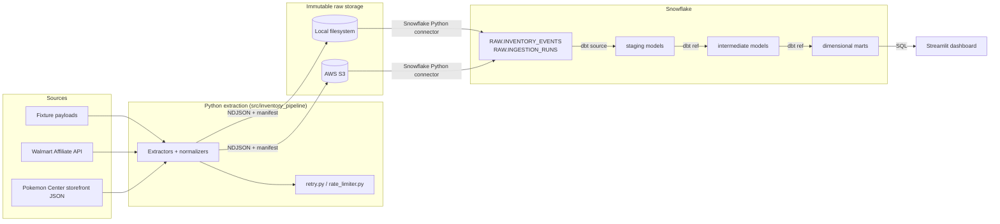
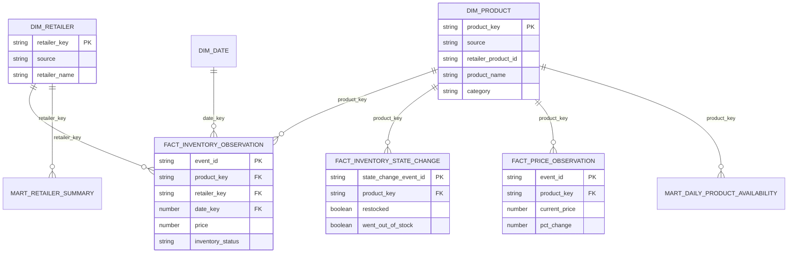
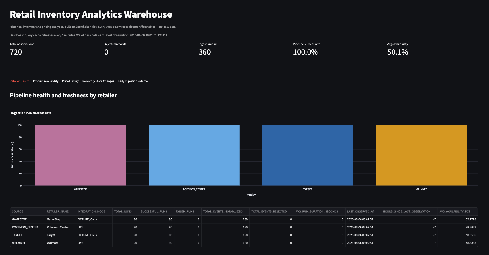
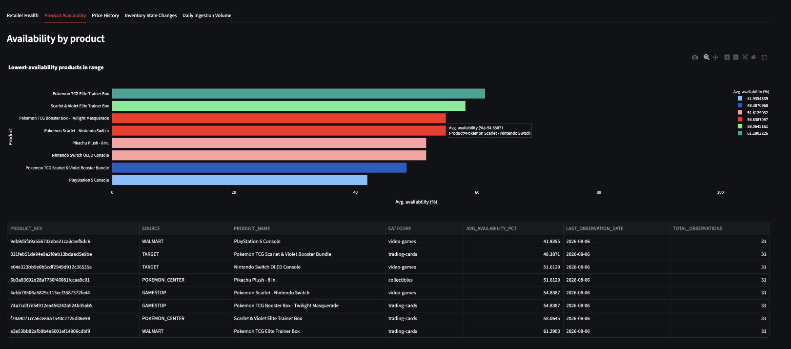
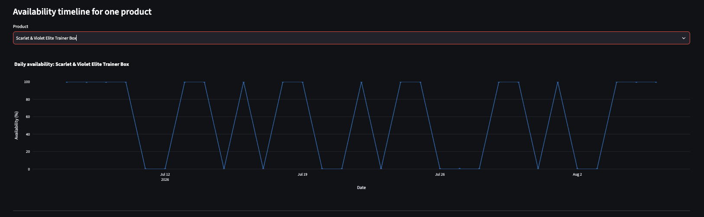
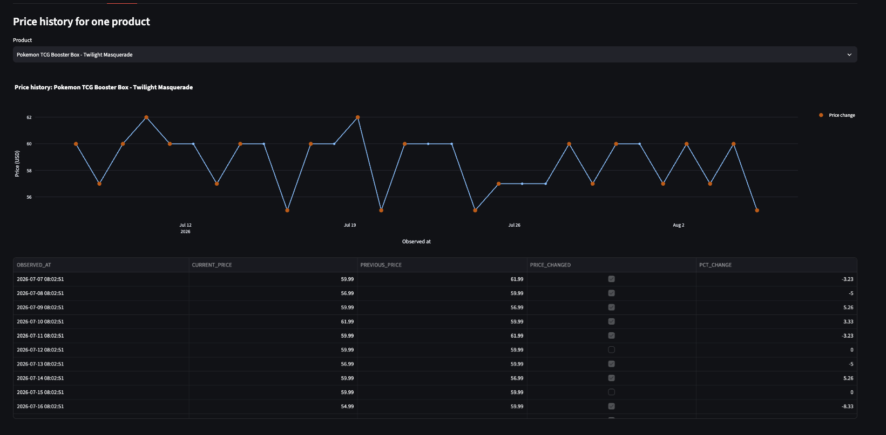
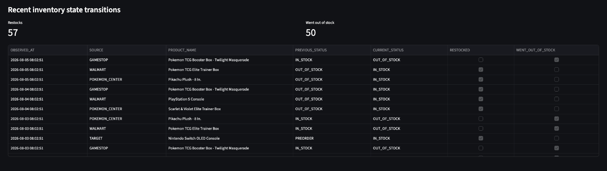
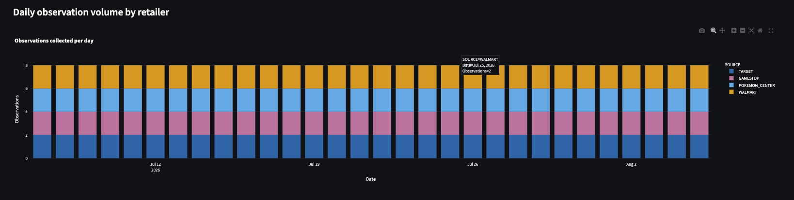

# Retail Inventory Analytics Warehouse

**Snowflake · dbt · Python · SQL · AWS S3 · Terraform · Jenkins · Streamlit**

An end-to-end ELT pipeline that collects retail inventory and pricing observations,
preserves them immutably, loads them into Snowflake, transforms them through dbt
into a tested dimensional model, and exposes the result through a Streamlit
dashboard. Runs entirely on bundled fixture data out of the box -- no retailer
credentials required to evaluate it.

## The problem

Retailers' current inventory/price is easy to see on their own sites. What's hard
to see, without collecting it yourself, is the *history*: how often is a product
actually in stock, how long does an outage last, how has its price moved, and
which of your data sources are actually reliable. This project builds the
warehouse that turns point-in-time polls into that history, and answers questions
like:

- How frequently is a product in stock?
- How long does a product remain unavailable once it goes out of stock?
- Which retailers have the highest product availability?
- How has a product's price changed over time?
- When did a product last transition from unavailable to available?
- How many inventory observations were collected each day?
- Which retailer integrations produce the most errors?
- How fresh is the newest data from each retailer?

## Relationship to the Real-Time Inventory Monitoring Platform

This is a separate project, not an extension of my [Discord inventory-alert
bot](../bot). The bot is a real-time application (poll -> diff -> alert); this is
a batch/incremental analytics system (poll -> preserve -> warehouse -> model ->
analyze). They share a domain (retail inventory) and I ported specific logic
across languages where it made sense -- retry/backoff, rate limiting, and the
per-retailer status-mapping logic, translated from TypeScript to Python -- but
the architectures, storage models, and goals are different enough that bolting
Snowflake onto the bot would have made both worse. Full rationale in
[docs/decisions.md](docs/decisions.md).

## Architecture



**Data flow, in words:**

1. `inventory-pipeline ingest` runs one extractor per retailer (fixture-backed by
   default). Each writes the *unmodified* source payload, the normalized
   `InventoryEvent` records, and a run manifest to a partitioned, append-only
   location (`raw/source=<X>/year=/month=/day=/run_id=<uuid>/`).
2. `inventory-pipeline load-snowflake` reads every run's output and `MERGE`s it
   into `RAW.INVENTORY_EVENTS` / `RAW.INGESTION_RUNS`, keyed on deterministic IDs
   -- reloading the same data twice never creates duplicates.
3. `dbt build` runs staging (rename/cast/standardize) -> intermediate (dedup,
   state-change detection via `LAG()`, daily rollups, price-change detection) ->
   marts (star schema: `dim_product`, `dim_retailer`, `dim_date`,
   `fact_inventory_observation`, `fact_inventory_state_change`,
   `fact_price_observation`, plus two summary marts), running dbt's tests at
   every layer.
4. The Streamlit dashboard queries the mart layer only.

## Repository structure

```
retail-inventory-analytics-warehouse/
├── src/inventory_pipeline/     Python package: config, models, extractors,
│                                normalizers, storage, loaders, pipeline, CLI
├── data/fixtures/               Product catalog + fixture payload generators
├── snowflake/                   setup.sql, roles.sql, cleanup.sql
├── dbt_inventory/                dbt project: sources, staging, intermediate,
│                                  marts, macros, tests, seeds
├── dashboard/                    Streamlit app (app.py, db.py, queries.py)
├── tests/unit/                   pytest unit tests (56 tests, no external deps)
├── tests/integration/            scaffolding for tests requiring live creds
├── terraform/                    IaC for the AWS + Snowflake resources above
│                                  (bootstrap/, modules/s3, modules/iam, modules/snowflake)
├── jenkins/, Jenkinsfile*        Local Jenkins controller image + pipelines
│                                  (PR validation, scheduled pipeline, terraform plan)
└── docs/                         architecture, data dictionary, decisions, metrics
```

## Quick start (fixture mode, no credentials)

```bash
git clone <this-repo>
cd retail-inventory-analytics-warehouse
cp .env.example .env          # defaults are fixture mode, local storage
make install                  # creates .venv, installs the package + dev/dbt deps
make lint                     # ruff check
make test                     # pytest tests/unit
make ingest-fixtures          # writes 14 simulated days of raw + normalized events
```

At this point `data/raw/` contains a partitioned, append-only tree of raw
payloads, normalized events, and manifests you can inspect directly -- no
Snowflake account needed to see the extraction layer work.

## Full pipeline (requires a Snowflake account)

1. **Create a Snowflake account.** The
   [free trial](https://signup.snowflake.com/) is enough; this project uses an
   XSMALL warehouse with auto-suspend.
2. **Provision the environment.** In a Snowflake worksheet, as your admin role,
   run `snowflake/setup.sql` then `snowflake/roles.sql`. These create the
   `RETAIL_INVENTORY` database, `RAW`/`ANALYTICS` schemas, `RETAIL_INVENTORY_WH`
   warehouse, and a scoped `RETAIL_INVENTORY_ROLE`.
3. **Fill in `.env`** with `SNOWFLAKE_ACCOUNT`, `SNOWFLAKE_USER`, and
   `SNOWFLAKE_PASSWORD` (or `SNOWFLAKE_PRIVATE_KEY_PATH` -- see
   [docs/architecture.md](docs/architecture.md) for key-pair setup).
4. **Run the pipeline:**
   ```bash
   make ingest-fixtures     # or: make ingest-live (Walmart/Pokemon Center only)
   make load-snowflake      # idempotent MERGE into RAW.*
   make dbt-deps            # installs dbt_utils
   make dbt-build           # builds + tests staging/intermediate/marts
   make dbt-docs            # generates and serves the dbt docs/lineage site
   ```
   Or run the whole thing (ingest -> load -> `dbt build`) with `make pipeline`.
5. **Launch the dashboard:**
   ```bash
   make dashboard            # streamlit run dashboard/app.py
   # or: docker compose up   # containerized, same env vars
   ```
6. **When you're done, tear it down:** run `snowflake/cleanup.sql` to drop the
   database, warehouse, and role and stop any possibility of further credit use.

## AWS S3 (optional raw storage backend)

Local filesystem storage is the default and is sufficient for evaluating this
project. To use S3 instead: create a bucket, set `RAW_STORAGE_BACKEND=s3`,
`S3_BUCKET`, `AWS_REGION`, and AWS credentials (env vars, or an IAM role if
running in AWS) in `.env`. The same partitioned key layout is used in both
backends, and the loader reads through the same `RawStorage` interface either way.

## CI/CD (Jenkins)

CI/CD runs on a local Jenkins controller (Docker), not a hosted SaaS runner --
see [`jenkins/`](jenkins/) for the image and [`Jenkinsfile`](Jenkinsfile) /
[`jenkins/Jenkinsfile.scheduled`](jenkins/Jenkinsfile.scheduled) /
[`jenkins/Jenkinsfile.terraform`](jenkins/Jenkinsfile.terraform) for the three
pipelines:

- **`Jenkinsfile`** (PR validation) -- lint, format check, and unit tests
  always run; `dbt parse` (structural validation, no warehouse needed) always
  runs; ingest + load + `dbt build` against a real Snowflake CI schema runs
  only when the `RUN_DBT_BUILD` build parameter is checked (Jenkins has no
  GitHub-Actions-style "only if this secret exists" condition, so it's an
  explicit parameter instead).
- **`jenkins/Jenkinsfile.scheduled`** -- runs on a cron trigger (fixture mode)
  or manually with the `SOURCE_MODE` build parameter (fixture or live), loads
  Snowflake, runs `dbt build`, and archives run manifests and dbt results as
  build artifacts. Fails loudly (nonzero exit) if any dbt test fails.
- **`jenkins/Jenkinsfile.terraform`** -- `terraform fmt -check` and
  `terraform validate` always run; the real `terraform plan` stage is gated to
  changes under `terraform/` and needs AWS/Snowflake credentials. Never
  applies -- see [Infrastructure as Code (Terraform)](#infrastructure-as-code-terraform)
  below.

### Running it locally

```bash
cp .env.jenkins.example .env.jenkins   # set JENKINS_ADMIN_ID / JENKINS_ADMIN_PASSWORD
docker compose up -d jenkins
# http://localhost:8080, log in with the admin credentials above
```

The image bootstraps the admin user via Jenkins Configuration as Code
(`jenkins/casc.yaml`) so there's no setup wizard to click through. From there:

1. **New Item → Pipeline**, one for each of the three Jenkinsfiles above,
   with "Pipeline script from SCM" pointing at this repo (once you've pushed
   your own commits -- a local Jenkins has no public endpoint for GitHub to
   webhook into, so use "Poll SCM" as the trigger, e.g. `H/5 * * * *`).
2. **Manage Jenkins → Credentials**, add the credentials each Jenkinsfile's
   `withCredentials` block references: `snowflake-private-key` (Secret file,
   the key-pair `.p8`), `snowflake-account` / `snowflake-user` /
   `snowflake-role` / `snowflake-warehouse` / `snowflake-database` /
   `snowflake-schema` / `snowflake-schema-analytics` (Secret text, one each),
   `walmart-api-key` (Secret text, for live-mode scheduled runs), and for the
   Terraform job: `aws-jenkins-ci` (Username with password -- the
   `jenkins_ci` IAM user's access key ID/secret from
   `terraform output jenkins_ci_user_name` +
   `aws iam create-access-key --user-name <that>`), plus `aws-region`,
   `tf-state-bucket`, `tf-lock-table`, `tf-var-raw-bucket-name`,
   `snowflake-organization-name`, `snowflake-account-name` (Secret text).
3. Run a build, watch the console log.

Skipping credential setup is fine -- lint/test/`dbt parse`/`terraform
fmt+validate` all run and pass with no secrets configured at all.

## Infrastructure as Code (Terraform)

Every AWS and Snowflake resource above was originally created by hand
(`snowflake/setup.sql`, `snowflake/roles.sql`, and a manually-created S3
bucket). [`terraform/`](terraform/) codifies that same setup so it can be
recreated, reviewed, and diffed instead of clicked or run ad hoc:

```
terraform/
├── bootstrap/          -- one-time: creates the state bucket + lock table (local state)
├── modules/
│   ├── s3/              -- raw payload bucket: versioning, SSE-S3, public access block, Glacier lifecycle
│   ├── iam/              -- jenkins_ci IAM user (S3 ingestion + read-only terraform plan), Snowflake storage-integration role
│   └── snowflake/       -- database, RAW/ANALYTICS schemas, XSMALL warehouse, dbt role, storage integration
├── main.tf, variables.tf, outputs.tf, versions.tf, backend.tf
├── terraform.tfvars.example   -- copy to terraform.tfvars (gitignored)
└── backend.hcl.example        -- copy to backend.hcl (gitignored)
```

A few design choices worth calling out:

- **RAW/ANALYTICS, not raw/staging/marts.** The Snowflake module creates the
  two schemas that actually exist today -- `RAW` and `ANALYTICS` -- rather
  than a literal staging/marts split. dbt's custom schema naming
  (`+schema:` in `dbt_project.yml`) creates `ANALYTICS_STAGING`,
  `ANALYTICS_INTERMEDIATE`, `ANALYTICS_MARTS`, and `ANALYTICS_SEEDS` under
  `ANALYTICS` at run time, which is why the dbt role gets `CREATE SCHEMA` +
  future-schema grants instead of Terraform trying to pre-create every layer
  (see `modules/snowflake/variables.tf` for the full reasoning).
- **Jenkins authenticates with a scoped IAM user, not OIDC.** GitHub Actions
  can do keyless OIDC federation because AWS calls back into GitHub's public
  JWKS endpoint; a local Jenkins controller has no public endpoint for AWS to
  reach, so there's no equivalent federation target. The `jenkins_ci` IAM
  user's access key (created out-of-band with `aws iam create-access-key`,
  never by Terraform, so the secret never lands in state) is the pragmatic
  tradeoff instead, stored only in Jenkins' credential store.
- **That user is read-only for Terraform.** It can read state, hold the
  DynamoDB lock, and describe the S3/IAM resources this config manages --
  enough for an accurate `terraform plan` -- but has no mutating AWS
  permissions. Applies are run manually, from a developer machine, on purpose.

### The bootstrap problem: the state bucket has to exist before the backend can use it

`terraform/backend.tf` configures an S3 backend with DynamoDB locking, but
Terraform's S3 backend can't create its own bucket and lock table -- by the
time `terraform init` runs against that backend, both must already exist.
Pointing the main config at itself to create them is circular.

The fix is `terraform/bootstrap/`: a small, separate root module with its
own **local** state (deliberately not the S3 backend) that creates exactly
two things -- the state bucket and the DynamoDB lock table -- and nothing
else. Run it once, before anything else:

```bash
cd terraform/bootstrap
cp terraform.tfvars.example terraform.tfvars   # set a globally-unique bucket name
terraform init
terraform apply
terraform output   # note state_bucket_name and lock_table_name
```

Then point the main config at what bootstrap created:

```bash
cd ../
cp backend.hcl.example backend.hcl             # fill in from the outputs above
cp terraform.tfvars.example terraform.tfvars   # fill in the rest
terraform init -backend-config=backend.hcl
```

`bootstrap/`'s own state stays local (`terraform/bootstrap/terraform.tfstate`,
gitignored). That's a deliberate tradeoff, not an oversight: these two
resources change essentially never after creation, so losing that local
state file just means re-running `terraform import` against the
already-existing bucket/table if you ever need to modify them again -- it
does not put the main project's state at risk. `aws_s3_bucket.tfstate` also
sets `prevent_destroy = true` as a second safety net against `terraform
destroy` ever taking out the one thing everything else depends on.

### The other bootstrap problem: the Snowflake storage integration and its IAM role trust each other

`snowflake_storage_integration` needs an IAM role ARN to be created, but the
IAM role's trust policy needs to name Snowflake's actual IAM user ARN and
external ID -- values Snowflake only generates *after* the integration
exists. That's a genuine dependency cycle (A needs B's output, B needs A's
output), not something Terraform's graph can resolve in one pass, so this
needs two applies:

1. **First apply** (`storage_integration_iam_user_arn` and
   `storage_integration_external_id` left as their default `""`):
   `modules/iam` creates the role with a locked placeholder trust policy
   (trusts only the account's own root ARN, which by itself grants no
   cross-account access), and `modules/snowflake` creates the storage
   integration pointed at that role's ARN.
2. Read back the values Snowflake generated:
   ```bash
   terraform output snowflake_storage_integration_iam_user_arn
   terraform output snowflake_storage_integration_external_id
   ```
3. **Second apply**, passing those back in:
   ```bash
   terraform apply \
     -var "storage_integration_iam_user_arn=<value from step 2>" \
     -var "storage_integration_external_id=<value from step 2>"
   ```
   This updates only the IAM role's trust policy to trust that specific
   Snowflake IAM user + external ID -- everything else is a no-op diff.

Until step 3 runs, the storage integration exists in Snowflake but can't
actually assume the role, so `COPY INTO` / external stages against it will
fail with an access-denied error. That's expected for a config this size;
it's the same tradeoff AWS's own docs describe for this exact integration
pattern.

### Applying for the first time

```bash
cd terraform
terraform init -backend-config=backend.hcl
terraform plan   # review before applying anything by hand
terraform apply
# then the storage-integration second apply above
```

Snowflake credentials for the provider itself are read from environment
variables, not `terraform.tfvars` -- set `SNOWFLAKE_ORGANIZATION_NAME`,
`SNOWFLAKE_ACCOUNT_NAME`, `SNOWFLAKE_USER`, and either
`SNOWFLAKE_PRIVATE_KEY_PATH` or `SNOWFLAKE_PASSWORD` before running
`terraform plan`/`apply`. (These are the current, non-deprecated equivalents
of the combined `SNOWFLAKE_ACCOUNT` identifier used elsewhere in this
project -- the Snowflake Terraform provider warns on `account` /
`SNOWFLAKE_ACCOUNT`.) For `jenkins/Jenkinsfile.terraform` in CI, the
equivalent Jenkins credentials are listed in the
[CI/CD (Jenkins)](#cicd-jenkins) section above.

## Example commands

```bash
make install | lint | format | test          # dev loop
make ingest-fixtures | ingest-live            # extraction only
make load-snowflake                            # load raw storage -> Snowflake
make dbt-debug | dbt-build | dbt-docs          # dbt
make dashboard                                  # Streamlit
make pipeline                                   # ingest -> load -> dbt build
make metrics                                    # regenerate docs/project_metrics.md
make clean                                      # remove venv, dbt artifacts, caches

# Equivalent direct CLI (no Makefile dependency):
python -m inventory_pipeline.cli ingest --source-mode fixture --backfill-days 14
python -m inventory_pipeline.cli load-snowflake
python -m inventory_pipeline.cli pipeline --source-mode fixture
python -m inventory_pipeline.cli metrics
```

## Data model

Star schema in the `marts` layer (grain documented per-table in
[docs/data_dictionary.md](docs/data_dictionary.md)):



## Testing strategy

- **Python (pytest):** 56 unit tests covering config validation, canonical event
  validation (negative price/quantity rejected, deterministic event IDs, UTC
  normalization), all four retailers' normalization logic, extractor
  rejected-record handling, local raw storage (partitioning, overwrite
  protection, manifest integrity), retry/backoff behavior, the full
  ingestion pipeline, and CLI behavior. Run with `make test`. Tests that need
  live Snowflake/AWS credentials belong in `tests/integration/` and are marked
  `@pytest.mark.integration` so they're skipped by default.
- **dbt:** generic tests (`not_null`, `unique`, `relationships`,
  `accepted_values`, `dbt_utils.accepted_range`) on every layer; a custom
  reusable generic test (`not_far_in_future`, in `dbt_inventory/macros/`); two
  singular tests (`dbt_inventory/tests/`) -- one checking no observation claims
  to be from the future at the fact-table grain, one cross-checking the Python
  pipeline's own run manifests against what actually landed in the warehouse.
  Run with `make dbt-build` (`dbt build` runs models and tests together).

## Data quality approach

Validation happens at three layers, deliberately redundant:

1. **Python (`models.py`):** Pydantic rejects negative price/quantity and
   normalizes timestamps to UTC before anything is written to raw storage.
2. **dbt generic tests:** every staging/intermediate/mart column that has a
   known valid domain (status values, currency, percentage ranges) is tested.
3. **dbt singular tests:** cross-model and cross-system invariants that a
   single-column test can't express (see above).

Malformed source payloads are never silently dropped -- they become
`RejectedRecord`s with a reason and a truncated, non-sensitive excerpt, counted
in the run manifest and visible in the dashboard's pipeline-health tab.

## Cost control

- Snowflake warehouse is `XSMALL`, `AUTO_SUSPEND=60`, `AUTO_RESUME=TRUE`,
  `INITIALLY_SUSPENDED=TRUE` -- it only runs compute while a query is active.
- No streaming, no always-on compute, no Snowpipe. Loads and dbt runs are
  on-demand or on a low-frequency schedule (daily by default in CI).
- `snowflake/cleanup.sql` drops everything when you're done.

## Security considerations

- No credentials are committed. `.env` is gitignored; `.env.example` documents
  variable names only.
- `dbt_inventory/profiles.yml` is committed deliberately -- it contains only
  `env_var()` references, never a literal secret.
- Local development uses password auth for simplicity; CI uses Snowflake
  key-pair auth (`SNOWFLAKE_PRIVATE_KEY_PATH`), which is the stronger option and
  the one documented for any shared/automated environment.
- Rejected-record diagnostics are truncated and exclude anything from source
  responses beyond product-identifying fields -- no attempt to capture full
  payloads in logs.
- Live-mode retailer clients only call documented (Walmart Affiliate API) or
  intentionally public, unauthenticated storefront endpoints (Pokemon Center's
  Shopify `product.json`, a standard feature of the platform). See
  [docs/decisions.md](docs/decisions.md) for why Target and GameStop are
  fixture-only.

## Known limitations

- Target and GameStop have no live extractor -- their original integrations
  relied on undocumented internal endpoints, which this project intentionally
  does not port. Fixture data stands in for them.
- The fixture "backfill" is synthetic (seeded pseudo-random status/price
  variation), not captured real-world history -- it's designed to exercise the
  full pipeline and analytics realistically, not to represent actual market
  data.
- `dim_date` is a static spine (2024-01-01 through one year ahead), not derived
  from observed data -- simplest correct approach for a project this size.
- No orchestrator (Airflow, Dagster, etc.) -- Jenkins' cron trigger is
  sufficient at this scale; see docs/decisions.md for the reasoning.

## Future improvements

- Real live adapters for Target/GameStop if/when an official API exists.
- Snowflake Tasks/Streams for lower-latency loading instead of a scheduled batch.
- dbt exposures wiring the dashboard explicitly into the DAG for documentation.
- Alerting (e.g., a lightweight Slack webhook) on dbt test failures in CI.

## Screenshots

Captured from a real run against Snowflake: 720 fixture observations across
4 retailers, loaded via `make pipeline` and queried live by the dashboard.

**Retailer Health** -- pipeline run success rate, freshness, and error counts per retailer.


**Product Availability** -- lowest-availability products in the selected date range.


Per-product daily availability timeline, showing the restock/stock-out cycle:


**Price History** -- price over time for a single product, with change points marked.


**Inventory State Changes** -- recent restocks and stock-outs across all tracked products.


**Daily Ingestion Volume** -- observations collected per day, by retailer.


