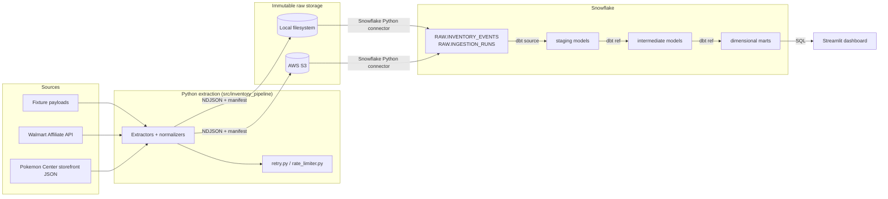

# Retail Inventory Analytics Warehouse

**Snowflake · dbt · Python · SQL · AWS S3 · GitHub Actions · Streamlit**

An end-to-end ELT pipeline that collects retail inventory and pricing observations,
preserves them immutably, loads them into Snowflake, transforms them through dbt
into a tested dimensional model, and exposes the result through a Streamlit
dashboard. Runs entirely on bundled fixture data out of the box -- no retailer
credentials required to evaluate it.

## The problem

Retailers' current inventory/price is easy to see on their own sites. What's hard
to see, without collecting it yourself, is the *history*: how often is a product
actually in stock, how long does an outage last, how has its price moved, and
which of your data sources are actually reliable. This project builds the
warehouse that turns point-in-time polls into that history, and answers questions
like:

- How frequently is a product in stock?
- How long does a product remain unavailable once it goes out of stock?
- Which retailers have the highest product availability?
- How has a product's price changed over time?
- When did a product last transition from unavailable to available?
- How many inventory observations were collected each day?
- Which retailer integrations produce the most errors?
- How fresh is the newest data from each retailer?

## Relationship to the Real-Time Inventory Monitoring Platform

This is a separate project, not an extension of my [Discord inventory-alert
bot](../bot). The bot is a real-time application (poll -> diff -> alert); this is
a batch/incremental analytics system (poll -> preserve -> warehouse -> model ->
analyze). They share a domain (retail inventory) and I ported specific logic
across languages where it made sense -- retry/backoff, rate limiting, and the
per-retailer status-mapping logic, translated from TypeScript to Python -- but
the architectures, storage models, and goals are different enough that bolting
Snowflake onto the bot would have made both worse. Full rationale in
[docs/decisions.md](docs/decisions.md).

## Architecture



**Data flow, in words:**

1. `inventory-pipeline ingest` runs one extractor per retailer (fixture-backed by
   default). Each writes the *unmodified* source payload, the normalized
   `InventoryEvent` records, and a run manifest to a partitioned, append-only
   location (`raw/source=<X>/year=/month=/day=/run_id=<uuid>/`).
2. `inventory-pipeline load-snowflake` reads every run's output and `MERGE`s it
   into `RAW.INVENTORY_EVENTS` / `RAW.INGESTION_RUNS`, keyed on deterministic IDs
   -- reloading the same data twice never creates duplicates.
3. `dbt build` runs staging (rename/cast/standardize) -> intermediate (dedup,
   state-change detection via `LAG()`, daily rollups, price-change detection) ->
   marts (star schema: `dim_product`, `dim_retailer`, `dim_date`,
   `fact_inventory_observation`, `fact_inventory_state_change`,
   `fact_price_observation`, plus two summary marts), running dbt's tests at
   every layer.
4. The Streamlit dashboard queries the mart layer only.

## Repository structure

```
retail-inventory-analytics-warehouse/
├── src/inventory_pipeline/     Python package: config, models, extractors,
│                                normalizers, storage, loaders, pipeline, CLI
├── data/fixtures/               Product catalog + fixture payload generators
├── snowflake/                   setup.sql, roles.sql, cleanup.sql
├── dbt_inventory/                dbt project: sources, staging, intermediate,
│                                  marts, macros, tests, seeds
├── dashboard/                    Streamlit app (app.py, db.py, queries.py)
├── tests/unit/                   pytest unit tests (56 tests, no external deps)
├── tests/integration/            scaffolding for tests requiring live creds
├── .github/workflows/            PR validation + scheduled pipeline
└── docs/                         architecture, data dictionary, decisions, metrics
```

## Quick start (fixture mode, no credentials)

```bash
git clone <this-repo>
cd retail-inventory-analytics-warehouse
cp .env.example .env          # defaults are fixture mode, local storage
make install                  # creates .venv, installs the package + dev/dbt deps
make lint                     # ruff check
make test                     # pytest tests/unit
make ingest-fixtures          # writes 14 simulated days of raw + normalized events
```

At this point `data/raw/` contains a partitioned, append-only tree of raw
payloads, normalized events, and manifests you can inspect directly -- no
Snowflake account needed to see the extraction layer work.

## Full pipeline (requires a Snowflake account)

1. **Create a Snowflake account.** The
   [free trial](https://signup.snowflake.com/) is enough; this project uses an
   XSMALL warehouse with auto-suspend.
2. **Provision the environment.** In a Snowflake worksheet, as your admin role,
   run `snowflake/setup.sql` then `snowflake/roles.sql`. These create the
   `RETAIL_INVENTORY` database, `RAW`/`ANALYTICS` schemas, `RETAIL_INVENTORY_WH`
   warehouse, and a scoped `RETAIL_INVENTORY_ROLE`.
3. **Fill in `.env`** with `SNOWFLAKE_ACCOUNT`, `SNOWFLAKE_USER`, and
   `SNOWFLAKE_PASSWORD` (or `SNOWFLAKE_PRIVATE_KEY_PATH` -- see
   [docs/architecture.md](docs/architecture.md) for key-pair setup).
4. **Run the pipeline:**
   ```bash
   make ingest-fixtures     # or: make ingest-live (Walmart/Pokemon Center only)
   make load-snowflake      # idempotent MERGE into RAW.*
   make dbt-deps            # installs dbt_utils
   make dbt-build           # builds + tests staging/intermediate/marts
   make dbt-docs            # generates and serves the dbt docs/lineage site
   ```
   Or run the whole thing (ingest -> load -> `dbt build`) with `make pipeline`.
5. **Launch the dashboard:**
   ```bash
   make dashboard            # streamlit run dashboard/app.py
   # or: docker compose up   # containerized, same env vars
   ```
6. **When you're done, tear it down:** run `snowflake/cleanup.sql` to drop the
   database, warehouse, and role and stop any possibility of further credit use.

## AWS S3 (optional raw storage backend)

Local filesystem storage is the default and is sufficient for evaluating this
project. To use S3 instead: create a bucket, set `RAW_STORAGE_BACKEND=s3`,
`S3_BUCKET`, `AWS_REGION`, and AWS credentials (env vars, or an IAM role if
running in AWS) in `.env`. The same partitioned key layout is used in both
backends, and the loader reads through the same `RawStorage` interface either way.

## GitHub Actions

Two workflows are included (see [.github/workflows/](.github/workflows/)):

- **`pr-validation.yml`** -- lint, format check, and unit tests always run;
  `dbt parse` (structural validation, no warehouse needed) always runs;
  `dbt build` against a real Snowflake dev schema runs only if Snowflake secrets
  are configured on the repo.
- **`scheduled-pipeline.yml`** -- runs daily (fixture mode) or on manual dispatch
  (fixture or live), loads Snowflake, runs `dbt build`, and uploads run manifests
  and dbt results as artifacts. Fails loudly (nonzero exit) if any dbt test fails.

**Manual setup required** (this project does not push secrets for you):
in your GitHub repo settings, add these encrypted secrets: `SNOWFLAKE_ACCOUNT`,
`SNOWFLAKE_USER`, `SNOWFLAKE_PRIVATE_KEY` (contents of a key-pair private key,
not a password -- see [docs/architecture.md](docs/architecture.md)),
`SNOWFLAKE_ROLE`, `SNOWFLAKE_WAREHOUSE`, `SNOWFLAKE_DATABASE`, `SNOWFLAKE_SCHEMA`,
`SNOWFLAKE_SCHEMA_ANALYTICS`, and optionally `WALMART_API_KEY` for live-mode runs.

## Example commands

```bash
make install | lint | format | test          # dev loop
make ingest-fixtures | ingest-live            # extraction only
make load-snowflake                            # load raw storage -> Snowflake
make dbt-debug | dbt-build | dbt-docs          # dbt
make dashboard                                  # Streamlit
make pipeline                                   # ingest -> load -> dbt build
make metrics                                    # regenerate docs/project_metrics.md
make clean                                      # remove venv, dbt artifacts, caches

# Equivalent direct CLI (no Makefile dependency):
python -m inventory_pipeline.cli ingest --source-mode fixture --backfill-days 14
python -m inventory_pipeline.cli load-snowflake
python -m inventory_pipeline.cli pipeline --source-mode fixture
python -m inventory_pipeline.cli metrics
```

## Data model

Star schema in the `marts` layer (grain documented per-table in
[docs/data_dictionary.md](docs/data_dictionary.md)):


## Testing strategy

- **Python (pytest):** 56 unit tests covering config validation, canonical event
  validation (negative price/quantity rejected, deterministic event IDs, UTC
  normalization), all four retailers' normalization logic, extractor
  rejected-record handling, local raw storage (partitioning, overwrite
  protection, manifest integrity), retry/backoff behavior, the full
  ingestion pipeline, and CLI behavior. Run with `make test`. Tests that need
  live Snowflake/AWS credentials belong in `tests/integration/` and are marked
  `@pytest.mark.integration` so they're skipped by default.
- **dbt:** generic tests (`not_null`, `unique`, `relationships`,
  `accepted_values`, `dbt_utils.accepted_range`) on every layer; a custom
  reusable generic test (`not_far_in_future`, in `dbt_inventory/macros/`); two
  singular tests (`dbt_inventory/tests/`) -- one checking no observation claims
  to be from the future at the fact-table grain, one cross-checking the Python
  pipeline's own run manifests against what actually landed in the warehouse.
  Run with `make dbt-build` (`dbt build` runs models and tests together).

## Data quality approach

Validation happens at three layers, deliberately redundant:

1. **Python (`models.py`):** Pydantic rejects negative price/quantity and
   normalizes timestamps to UTC before anything is written to raw storage.
2. **dbt generic tests:** every staging/intermediate/mart column that has a
   known valid domain (status values, currency, percentage ranges) is tested.
3. **dbt singular tests:** cross-model and cross-system invariants that a
   single-column test can't express (see above).

Malformed source payloads are never silently dropped -- they become
`RejectedRecord`s with a reason and a truncated, non-sensitive excerpt, counted
in the run manifest and visible in the dashboard's pipeline-health tab.

## Cost control

- Snowflake warehouse is `XSMALL`, `AUTO_SUSPEND=60`, `AUTO_RESUME=TRUE`,
  `INITIALLY_SUSPENDED=TRUE` -- it only runs compute while a query is active.
- No streaming, no always-on compute, no Snowpipe. Loads and dbt runs are
  on-demand or on a low-frequency schedule (daily by default in CI).
- `snowflake/cleanup.sql` drops everything when you're done.

## Security considerations

- No credentials are committed. `.env` is gitignored; `.env.example` documents
  variable names only.
- `dbt_inventory/profiles.yml` is committed deliberately -- it contains only
  `env_var()` references, never a literal secret.
- Local development uses password auth for simplicity; CI uses Snowflake
  key-pair auth (`SNOWFLAKE_PRIVATE_KEY_PATH`), which is the stronger option and
  the one documented for any shared/automated environment.
- Rejected-record diagnostics are truncated and exclude anything from source
  responses beyond product-identifying fields -- no attempt to capture full
  payloads in logs.
- Live-mode retailer clients only call documented (Walmart Affiliate API) or
  intentionally public, unauthenticated storefront endpoints (Pokemon Center's
  Shopify `product.json`, a standard feature of the platform). See
  [docs/decisions.md](docs/decisions.md) for why Target and GameStop are
  fixture-only.

## Known limitations

- Target and GameStop have no live extractor -- their original integrations
  relied on undocumented internal endpoints, which this project intentionally
  does not port. Fixture data stands in for them.
- The fixture "backfill" is synthetic (seeded pseudo-random status/price
  variation), not captured real-world history -- it's designed to exercise the
  full pipeline and analytics realistically, not to represent actual market
  data.
- `dim_date` is a static spine (2024-01-01 through one year ahead), not derived
  from observed data -- simplest correct approach for a project this size.
- No orchestrator (Airflow, Dagster, etc.) -- GitHub Actions' schedule trigger
  is sufficient at this scale; see docs/decisions.md for the reasoning.

## Future improvements

- Real live adapters for Target/GameStop if/when an official API exists.
- Snowflake Tasks/Streams for lower-latency loading instead of a scheduled batch.
- dbt exposures wiring the dashboard explicitly into the DAG for documentation.
- Alerting (e.g., a lightweight Slack webhook) on dbt test failures in CI.

## Screenshots

_Not yet captured._ To add: run `make pipeline` against a real Snowflake
account, `make dashboard`, and screenshot each tab (Retailer Health, Product
Availability, Price History, Inventory State Changes, Daily Ingestion Volume)
into `docs/screenshots/` and reference them here.

## Résumé bullets

See [docs/project_metrics.md](docs/project_metrics.md) for how to generate real,
measured numbers (`make metrics`) -- do not use placeholder values in a résumé.
Draft bullets, with `[MEASURE]` marking anything that must come from that report:

- Built an end-to-end ELT pipeline in Python and dbt that ingests retail
  inventory/pricing observations from `[MEASURE: N]` sources, preserves raw
  payloads immutably, and loads them into Snowflake with idempotent MERGE-based
  upserts.
- Designed a dimensional model in dbt (`[MEASURE: N]` models, `[MEASURE: N]`
  tests across staging/intermediate/mart layers) with an incremental
  fact-table model handling `[MEASURE: N]` historical observations.
- Implemented automated data-quality testing (generic + custom singular dbt
  tests, Pydantic validation at ingestion) achieving a `[MEASURE: N]`% pipeline
  run success rate across `[MEASURE: N]` ingestion runs.
- Automated CI/CD with GitHub Actions (lint, unit tests, dbt build) and built a
  Streamlit dashboard surfacing inventory availability, pricing history, and
  pipeline observability from tested Snowflake mart tables.
